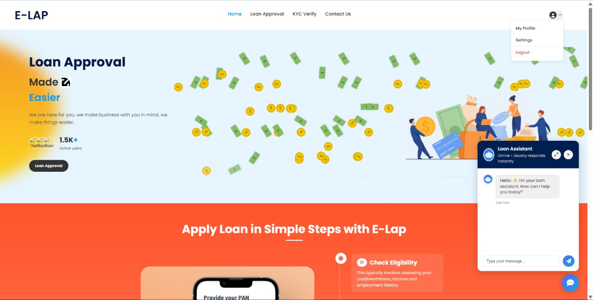
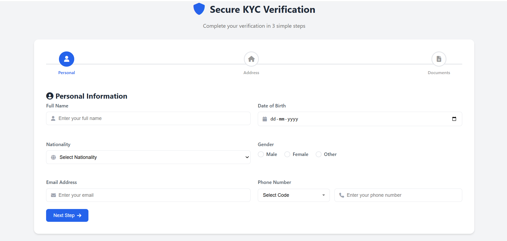

# E-LAP (E-Loan Approval Predictor)

[](https://nodejs.org/)
[](https://flask.palletsprojects.com/)
[](https://scikit-learn.org/)
[](https://rasa.com/)
[](https://www.mysql.com/)

E-LAP is a full-stack loan management and automation platform designed to streamline manual underwriting workflows. Rather than just predicting eligibility, E-LAP automates key stages of the approval lifecycle—including machine learning eligibility assessment, automated lender matching based on credit score profiles, digital KYC verification, and chatbot-assisted support—reducing overall loan processing time.

---

## ⚡ System Architecture

```text
  [Client Web UI] (Home, Login, ML Prediction, KYC, Lender Dashboard, Rasa Chatbot)
        │
        ▼ 
  [Node.js Express Server] ────── [MySQL Database] (Auth, Chat History, Lender Matching)
        │
        ├─► [Flask ML Service] ── (StandardScaler + Random Forest API)
        └─► [Rasa NLP Bot] ────── (REST Webhook + Offline Fallback UI)
```

---

## ✨ Key Features

* 🧠 **Automated Underwriting**: Instant eligibility evaluation from user profiles.
* 🎯 **Lender Matching**: Automates matching with lenders based on CIBIL and financial scores to eliminate manual search.
* 📈 **Lender Decision Workspace**: Control panel for institutions to approve or reject loan requests in real-time.
* 🤖 **Smart Chatbot**: Contextual NLP chat with suggestion chips and offline fallback.
* 🔒 **Secure Gateway**: JWT authorization, OTP codes, and hashed passwords.
* 📄 **KYC Document Upload**: Structured file verification pipeline with format checking.

## 📸 Screenshots

| 🏠 Portal Homepage | 📄 KYC Verification |
| :---: | :---: |
|  |  |
| *Landing layouts* | *File upload* |

---

## 📂 Project Structure

```text
E-LAP/
├── server.js                 # Express web application gateway server
├── config/                   # MySQL configuration and schema SQL scripts
├── routes/                   # Auth & message REST API endpoints
├── middleware/               # Stateless JWT auth validation
├── home/, login/, kyc/       # Static UI assets and workflows
├── loan/                     # Consolidated ML client prediction form
├── Loan_Model/               # ML service: Flask backend & scikit-learn pkl files
└── rasa_bot/                 # Rasa NLP model domain configurations
```

---

## 📊 Model Evaluation & Metrics

Trained on **4,000+ financial rows** (CIBIL, assets, income, loan amount, and term):

| Classifier | Accuracy | Precision | Recall |
| :--- | :---: | :---: | :---: |
| **Logistic Regression** | 92.15% | 0.91 | 0.93 |
| **Decision Tree** | 97.19% | 0.97 | 0.97 |
| **Random Forest (Deployed)** | **97.42%** | **0.98** | **0.97** |

---

## 🛠️ Installation & Setup

1. **Database Setup**:
   * Create local MySQL schema `loan_system` and configure credentials in root `.env`:
     ```env
     PORT=5000
     DB_HOST=localhost
     DB_USER=your_username
     DB_PASSWORD=your_password
     DB_NAME=loan_system
     JWT_SECRET=your_jwt_secret
     ```
   * Populate database structure:
     ```bash
     npm run init-db
     ```
2. **Install Dependencies**:
   ```bash
   npm install && pip install -r Loan_Model/requirements.txt
   ```

---

## 💻 Running the Application

Start all services in separate terminals:

```bash
# 1. Start Node.js Web Gateway Server
npm run dev

# 2. Start ML Classifier API Backend
python Loan_Model/app.py

# 3. Start Rasa Chatbot Server
rasa run --enable-api --cors "*"
```
*Access the portal locally via the Web Gateway port (configured in `.env`).*

---

## 🧠 Engineering Insights & Learnings

* **Stateless Microservices**: Isolating ML (Flask) and Chatbot (Rasa) logic from Express ensures that high-cpu classification or NLP execution never blocks Express HTTP loops.
* **Offline UI Resilience**: Configured a javascript fallback handler in `chatbot.js` that catches Rasa server offline states to load cached mock replies smoothly.
* **Path Independence**: Configured Flask file loaders to resolve model path references relative to the script location, avoiding target path directory crashes.

---

## 📄 License

Distributed under the MIT License. See [LICENSE](LICENSE) for more information.
